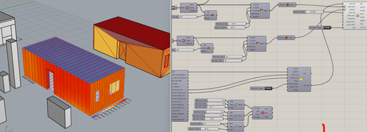

# ARCH-8833-Sp25-Tran-Optimal-Modular-Construction-Post-Disaster-Housing

# Research Title: Optimizing Modular Construction Design for Post-Disaster Housing

## Project Overview

This research explores **energy-efficient, resilient, and sustainable modular housing solutions** in post-disaster contexts. It focuses on the use of **multi-objective optimization (MOO)**, **parametric design tools**, and **life cycle assessment (LCA)** to evaluate trade-offs between environmental impact, cost, construction time, and functional performance.

Natural disasters such as wildfires, earthquakes, and hurricanes displace millions globally. Our goal is to build back better — not just fast, but smarter.

## 🎯 Research Goals

- Assess the **environmental sustainability** of modular construction in post-disaster housing.
- Utilize **simulation tools** (Rhino + Grasshopper + EnergyPlus) to optimize designs.
- Integrate **LCA** and **multi-objective optimization (NSGA-II)** to evaluate housing units.
- Develop a **decision-support framework** using AHP + Pareto Analysis.

## 🧰 Tools and Technologies

| Tool/Technology | Purpose |
|----------------|---------|
| Rhino 8 + Grasshopper | Parametric modeling |
| EnergyPlus + Honeybee | Energy simulation |
| Python (DEAP, Matplotlib) | Multi-objective optimization |
| AHP | Criteria prioritization |
| Tally + Revit | Life Cycle Assessment (LCA) |

## 🧪 Methodology

1. **Define Decision Criteria**  
   → Cost, Environmental Impact, Construction Time, and Functional Performance.

2. **Use Analytic Hierarchy Process (AHP)**  
   → Weight criteria based on expert judgment and literature.

3. **Run Multi-Objective Optimization (NSGA-II)**  
   → Generate a Pareto front of optimal modular designs.

4. **Simulate Energy & Carbon Footprint**  
   → Use Grasshopper + EnergyPlus to evaluate EUI and GWP.

5. **Visualize & Select Optimal Designs**  
   → Prioritize final designs based on AHP weights.

## 🔍 Key Findings

- Trade-offs are inevitable, but **data-driven design** helps navigate them.
- Modular housing units optimized via MOO show **~20% lower embodied carbon**.
- Energy-efficient configurations significantly reduce **operational carbon** (~2.05 kgCO₂e/m²/year).
- Pareto-optimal designs offer a **balanced solution** across all objectives.

## 📂 Repository Structure

📂 Repository Structure
├── data/                  # Raw and processed data
├── models/                # Optimization scripts and LCA configurations
├── docs/                  # Presentation, images, and supplementary materials
├── src/                   # Python scripts (AHP, MOO, Energy Simulation)
├── results/               # Pareto fronts, EUI results, selection outputs
├── README.md

## 👤 Author

**Tran Nguyen**  
Ph.D. Student | Georgia Tech  
[LinkedIn](https://www.linkedin.com/feed/?trk=404_page) • [ResearchGate](https://www.researchgate.net/profile/Tran-Duong-Nguyen/research)

## 📚 Related Papers & References

- Nguyen, T. (2025). _Choosing the Optimal Modular Construction Design in Post-Disaster Housing_. Final Project, ARCH_8833.
- Shahzad, W. et al. (2022). _Modular Offsite Construction for Emergency Situations: A New Zealand Study_. Buildings.
- Rocha, P. et al. (2023). _Impacts of Prefabrication in the Building Construction Industry_. Encyclopedia.
- - ...

## 🚀 Future Work

- Integrate **blockchain** for supply chain transparency.
- Apply **AI-based generative design** to refine module assembly.
- Extend framework for **multi-hazard resilience**.

---

_This project is part of the Spring 2025 ARCH_8833 coursework at Georgia Tech._
