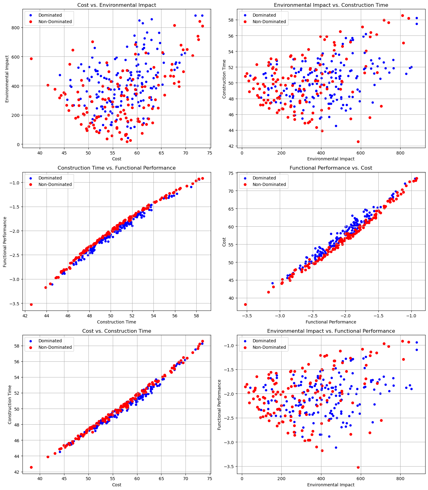

# ARCH-8833-Sp25-Tran-Optimal-Modular-Construction-Post-Disaster-Housing

# Research Title: Optimizing Modular Construction Design for Post-Disaster Housing

## Project Overview

This research explores **energy-efficient, resilient, and sustainable modular housing solutions** in post-disaster contexts. It focuses on the use of **multi-objective optimization (MOO)**, **parametric design tools**, and **life cycle assessment (LCA)** to evaluate trade-offs between environmental impact, cost, construction time, and functional performance.

Natural disasters such as wildfires, earthquakes, and hurricanes displace millions globally. Our goal is to build back better — not just fast, but smarter.

## 🎯 Research Goals

- Assess the **environmental sustainability** of modular construction in post-disaster housing.
- Utilize **simulation tools** (Rhino + Grasshopper + Other tools) to optimize designs.
- Integrate **LCA** and **multi-objective optimization (NSGA-II)** to evaluate housing units.
- Develop a **decision-support framework** using AHP + Pareto Analysis.

## ❓ Research Questions

1. How can modular construction improve sustainability in post-disaster housing?
2. What are the key environmental indicators to assess?
3. How effective are simulation tools in optimizing performance?

---

## 🧪 Methodology

1. **Define Decision Criteria**  
   → Cost, Environmental Impact, Construction Time, and Functional Performance.

2. **Use Analytic Hierarchy Process (AHP)**  
   → Weight criteria based on expert judgment and literature.

3. **Run Multi-Objective Optimization (NSGA-II)**  
   → Generate a Pareto front of optimal modular designs.

4. **Simulate Energy & Carbon Footprint**  
   → Use Grasshopper + EnergyPlus to evaluate EUI and GWP.

5. **Visualize & Select Optimal Designs**  
   → Prioritize final designs based on AHP weights.

## ⚙️ Tools and Technologies

| Tool | Purpose |
|------|---------|
| Rhino 8 + Grasshopper | Parametric modeling |
| Ladybug + Honeybee | Energy simulation |
| EnergyPlus | Climate-adaptive energy modeling |
| DEAP (Python) | Evolutionary optimization (NSGA-II) |
| Tally + Revit | Life Cycle Assessment |
| AHP | Decision-making framework |

---

## 📈 Key Results

- **Modular designs reduced embodied carbon by 20–35%** over traditional units.
- **Operational energy** (EUI) achieved 154.04 kWh/m²/year.
- Optimal units reached **2.05 kgCO₂e/m²/year** operational carbon.
- **Pareto-optimal designs** revealed trade-offs and clustering around performance-cost thresholds.
- **Top design**: Cost-effective, resilient, and prefabricated with rapid deployment (< 43 days).

---
## 🔍 Key Findings

- Trade-offs are inevitable, but **data-driven design** helps navigate them.
- Modular housing units optimized via MOO show **~20% lower embodied carbon**.
- Energy-efficient configurations significantly reduce **operational carbon** (~2.05 kgCO₂e/m²/year).
- Pareto-optimal designs offer a **balanced solution** across all objectives.

## 📊 Findings Snapshot

| Module Type | Embodied Carbon (kgCO₂e) | Material Mass (kg) | EUI (kWh/m²/yr) | Op. Carbon (kgCO₂e/m²/yr) |
|-------------|---------------------------|---------------------|------------------|-----------------------------|
| Type 1 Wet  | 2,562.60                  | 5,633.73            | 154.04           | 2.05                        |
| Type 2 Dry  | 2,594.37                  | 4,722.51            | ~Similar         | ~Similar                    |
| Type 3 King | 3,944.57                  | 4,799.99            | Higher           | Higher                      |
| Type 4 Queen| 3,302.93                  | 6,889.86            | Higher           | Higher                      |

---
## 📂 Repository Structure

📂 Repository Structure
├── data/ # Raw and processed data
├── models/ # Optimization scripts and LCA configurations
├── docs/ # Presentation, images, and supplementary materials
├── src/ # Python scripts (AHP, MOO, Energy Simulation)
├── results/ # Pareto fronts, EUI results, selection outputs
└── README.md

## 👤 Author

**Tran Duong Nguyen**  
Ph.D. Student | Georgia Tech  
[LinkedIn](https://www.linkedin.com/feed/?trk=404_page) • [ResearchGate](https://www.researchgate.net/profile/Tran-Duong-Nguyen/research)

## 📚 Related Papers & References

- Nguyen, T. (2025). _Post-Disaster Housing: Analyzing Environmental Sustainability of Modular Construction_. ARCH-8833, Georgia Tech.
- Shahzad, W. et al. (2022). _Modular Offsite Construction for Emergency Situations_. Buildings.
- Müller, A. et al. (2024). _Post-Disaster Modular Strategies and Resilience_. Int. J. Resilient Cities.
- Gupta, R., Kim, Y., & Chan, C. (2022). _AI and Simulation for Post-Disaster Housing_. Smart Cities Journal.
- 
---
## 🚀 Future Work

- Test in multiple **climate zones** with passive strategies
- Extend to **digital twin** applications for real-time monitoring
- Explore **blockchain** for modular supply chains
- Integrate **occupant behavior models** in energy simulation

---

_This project is part of the Spring 2025 ARCH_8833 coursework at Georgia Tech._
